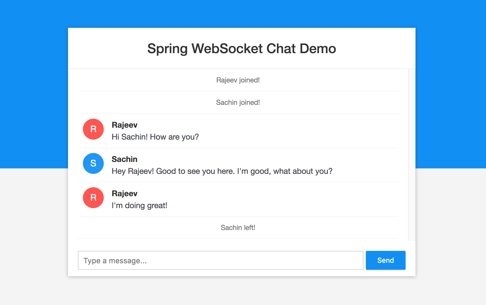

## Spring Boot WebSocket Chat Appplication

You can checkout the live version of the application at https://spring-ws-chat.herokuapp.com/



## Requirements

1. Java - 1.8.x

2. Maven - 3.x.x

## Steps to Setup

**1. Clone the application**

```bash
git clone https://github.com/uzair119/chatapp.git
```

**2. Build and run the app using maven**

```bash
cd chatapp
mvn package
java -jar target/websocket-demo-0.0.1-SNAPSHOT.jar
```

Alternatively, you can run the app directly without packaging it like so -

```bash
mvn spring-boot:run
```
